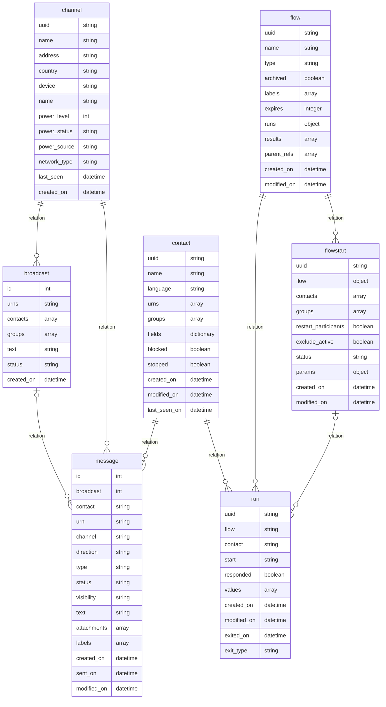

# Database Relationship

This file contains a ER diagram, written with Markdown-inspired text definitions in mermaid syntax, for data models used in this custom connector.
It can be rendered in tools that support [mermaid](https://mermaid-js.github.io/mermaid).

